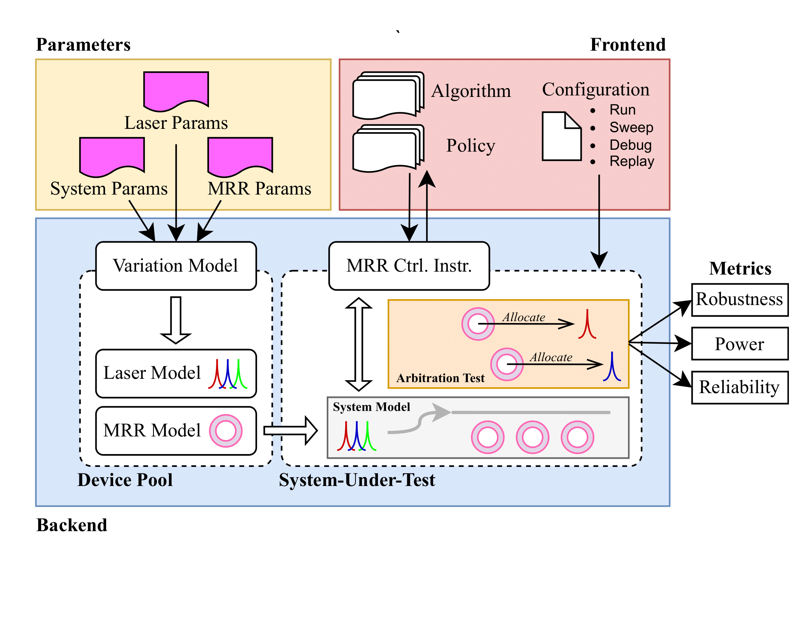

.. _batch_mode:

=================
Batch Run via CLI
=================

In this section, we explain the batch simulation mode through command-line interface (CLI).
While individual python scripts can be used to run simple simulations or with a highly customized setup, we offer CLI to enable a massively parallel simulation.
This includes the device pool generation with dedicated configurations, multi-processings and output statistics generation.

This figure shows the overall flow of the batch simulation mode, which is the main focus of this section.

Run Mode
========

Now, let's try to run the first batch-mode simulation.

First, run the following command in your session:

.. code-block:: console

    $ wdmsim run --help

which will print this help message:

.. code-block:: console

    Usage: wdmsim run [OPTIONS]

      Run a single experiment

    Options:
      --profile                       Run in profile mode
      -nl, --num_laser_swaps INTEGER  Number of laser swap iterations  [default:
                                      10]
      -nr, --num_ring_swaps INTEGER   Number of ring swap iterations  [default: 1]
      -a, --arbiter TEXT              Arbiter of choice  [required]
      -lf, --laser_config_file FILE   Laser config file  [default:
                                      configs/example_laser_config.yml]
      -ls, --laser_config_section TEXT
                                      Laser config section  [default: msa-8]
      -rf, --ring_config_file FILE    Ring config file  [default:
                                      configs/example_ring_config.yml]
      -rs, --ring_config_section TEXT
                                      Ring config section  [default: msa-8]
      -ilof, --init_lane_order_config_file FILE
                                      Ring config file  [default:
                                      configs/example_lane_order.yml]
      -ilos, --init_lane_order_config_section TEXT
                                      Ring config section  [default: linear_8]
      -tlof, --tgt_lane_order_config_file FILE
                                      Ring config file  [default:
                                      configs/example_lane_order.yml]
      -tlos, --tgt_lane_order_config_section TEXT
                                      Ring config section  [default: linear_8]
      --results_dir DIRECTORY         Results directory  [default: results]
      -v, --verbose                   Enable verbose output
      --help                          Show this message and exit.

    Arbiter Options:
      [index]: [arbiter]
            0: example_one_by_one

Now, change directory into the provided example (``examples/`` in the cloned repo).
You can check the configuration file: ``example_run_config.yaml``.

.. code-block:: console

    $ cat example_run_config.yaml
    # examples/example_run_config.yaml
    linear:
      run: SINGLE
      type: LANEORDER  
      attribute:
        alias: 'LINEAR'
        lane:
          0: 0
          1: 1
          2: 2
          3: 3

    ring-4:
      run: SINGLE
      type: RING  
      attribute:
        fsr_mean: 8.96e-9
        fsr_variance: 0.01
        tuning_range_mean: 4.48e-9
        tuning_range_variance: 0.10
        inherit_laser_variance: false
        resonance_variance: 2.0e-9

    laser-4:
      run: SINGLE
      type: LASER
      attribute:
        num_channel: 4
        center_wavelength: 1300.05e-9
        grid_spacing: 2.24e-9
        grid_max_offset: 5.0e-9
        grid_variance: 0.05

As explained in the previous section, we model 4-channel DWDM system with linear lane order, 2nm local ring resonance variation and approximately half-FSR tuning range.

Now, you can run the provided shell script to plug the configurations and run the simulation:

.. code-block:: console

    $ cat run_example.sh
    #!/bin/bash

    wdmsim run \
        --arbiter example_one_by_one \
        --num_laser_swaps 2 \
        --num_ring_swaps 2 \
        --laser_config_file example_run_config.yaml \
        --ring_config_file example_run_config.yaml \
        --init_lane_order_config_file example_run_config.yaml \
        --tgt_lane_order_config_file example_run_config.yaml \
        --laser_config_section laser-4 \
        --ring_config_section ring-4 \
        --init_lane_order_config_section linear \
        --tgt_lane_order_config_section linear \
        --verbose

    $ ./run_example.sh
    

The output should start with a general meta-data print in your terminal:

.. code-block:: console

    [root] ================================================================================
    [root] ================================ WDM Simulator =================================
    [root] ================================================================================
    [root] [Config]   ::    file :: section
    [root]  laser     ::    example_run_config.yaml                  ::      laser-4
    [root]  ring      ::    example_run_config.yaml                  ::       ring-4
    [root]  init_lane ::    example_run_config.yaml                  ::       linear
    [root]  tgt_lane  ::    example_run_config.yaml                  ::       linear
    [root] ================================================================================
    [root] [Laser Design Parameters]
    [root]  num_channel                              ::            4
    [root]  center_wavelength                        ::  1.30005e-06
    [root]  grid_spacing                             ::     2.24e-09
    [root]  grid_variance                            ::         0.05
    [root]  grid_max_offset                          ::        5e-09
    [root] ================================================================================
    [root] [Ring Design Parameters]
    [root]  fsr_mean                                 ::     8.96e-09
    [root]  fsr_variance                             ::         0.01
    [root]  tuning_range_mean                        ::     4.48e-09
    [root]  tuning_range_variance                    ::          0.1
    [root]  inherit_laser_variance                   ::        False
    [root]  resonance_variance                       ::        2e-09
    [root] ================================================================================
    [root] [Initial Lane Order Parameters]
    [root]  alias                                    ::       LINEAR
    [root] ================================================================================
    [root] [Target Lane Order Parameters]
    [root]  alias                                    ::       LINEAR
    [root] ================================================================================
    [root] [Arbiter of Choice]
    [root]  class_name                               :: example_one_by_one
    [root] ================================================================================
    [root] =============================== Experiment Start ===============================
    [root] ================================================================================

And unfold below to see the full example output (note that the output always changes due to randomization, we will add a seeded-randomization feature in the future):

.. toggle:: run-log-cli

    .. code-block:: console

        [root] ================================================================================
        [root] ================================ WDM Simulator =================================
        [root] ================================================================================
        [root] [Config]   ::    file :: section
        [root]  laser     ::    example_run_config.yaml                  ::      laser-4
        [root]  ring      ::    example_run_config.yaml                  ::       ring-4
        [root]  init_lane ::    example_run_config.yaml                  ::       linear
        [root]  tgt_lane  ::    example_run_config.yaml                  ::       linear
        [root] ================================================================================
        [root] [Laser Design Parameters]
        [root]  num_channel                              ::            4
        [root]  center_wavelength                        ::  1.30005e-06
        [root]  grid_spacing                             ::     2.24e-09
        [root]  grid_variance                            ::         0.05
        [root]  grid_max_offset                          ::        5e-09
        [root] ================================================================================
        [root] [Ring Design Parameters]
        [root]  fsr_mean                                 ::     8.96e-09
        [root]  fsr_variance                             ::         0.01
        [root]  tuning_range_mean                        ::     4.48e-09
        [root]  tuning_range_variance                    ::          0.1
        [root]  inherit_laser_variance                   ::        False
        [root]  resonance_variance                       ::        2e-09
        [root] ================================================================================
        [root] [Initial Lane Order Parameters]
        [root]  alias                                    ::       LINEAR
        [root] ================================================================================
        [root] [Target Lane Order Parameters]
        [root]  alias                                    ::       LINEAR
        [root] ================================================================================
        [root] [Arbiter of Choice]
        [root]  class_name                               :: example_one_by_one
        [root] ================================================================================
        [root] =============================== Experiment Start ===============================
        [root] ================================================================================
        [wdmsim.models.tuner] sweep range: [[1256.96, 1261.16], [1265.87, 1270.07], [1274.77, 1278.98], [1283.68, 1287.88], [1292.58, 1296.79], [1301.49, 1305.69], [1310.4, 1314.6], [1319.3, 1323.51], [1328.21, 1332.41]]
        [wdmsim.models.tuner] incoming wavelengths [1298.96, 1301.17, 1303.36, 1305.58]
        [wdmsim.models.tuner] sweep range: [[1259.33, 1264.13], [1268.28, 1273.08], [1277.24, 1282.03], [1286.19, 1290.99], [1295.14, 1299.94], [1304.1, 1308.89], [1313.05, 1317.85], [1322.0, 1326.8], [1330.96, 1335.75]]
        [wdmsim.models.tuner] incoming wavelengths [1298.96, 1301.17, 1303.36, 1305.58]
        [wdmsim.models.tuner] sweep range: [[1260.41, 1264.59], [1269.28, 1273.46], [1278.15, 1282.33], [1287.02, 1291.21], [1295.89, 1300.08], [1304.76, 1308.95], [1313.63, 1317.82], [1322.51, 1326.69], [1331.38, 1335.56]]
        [wdmsim.models.tuner] incoming wavelengths [1298.96, 1301.17, 1303.36, 1305.58]
        [wdmsim.models.tuner] sweep range: [[1261.04, 1265.25], [1269.94, 1274.15], [1278.84, 1283.05], [1287.74, 1291.95], [1296.64, 1300.84], [1305.54, 1309.74], [1314.43, 1318.64], [1323.33, 1327.54], [1332.23, 1336.44]]
        [wdmsim.models.tuner] incoming wavelengths [1298.96, 1301.17, 1303.36, 1305.58]
        [wdmsim.models.system_under_test] Target Ring->Laser ordering
        R0 -> L0, R1 -> L1, R2 -> L2, R3 -> L3
        [wdmsim.models.system_under_test] Target Laser->Ring ordering
        L0 -> R0, L1 -> R1, L2 -> R2, L3 -> R3
        [wdmsim.models.system_under_test] Search Table
        +----+---------+--------+--------+---------+--------+--------+---------+--------+--------+---------+--------+--------+
        |    |    R0/W |   R0/C |   R0/L |    R1/W |   R1/C |   R1/L |    R2/W |   R2/C |   R2/L |    R3/W |   R3/C |   R3/L |
        +====+=========+========+========+=========+========+========+=========+========+========+=========+========+========+
        |  0 | 1303.36 |    113 |      - | 1305.58 |     78 |      - | 1305.58 |     49 |      - | 1305.58 |      2 |      - |
        +----+---------+--------+--------+---------+--------+--------+---------+--------+--------+---------+--------+--------+
        |  1 | 1305.58 |    248 |      - | 1298.96 |    203 |      - | 1298.96 |    187 |      - | 1298.96 |    141 |      - |
        +----+---------+--------+--------+---------+--------+--------+---------+--------+--------+---------+--------+--------+
        [wdmsim.models.tuner] sweep range: [[1256.96, 1261.16], [1265.87, 1270.07], [1274.77, 1278.98], [1283.68, 1287.88], [1292.58, 1296.79], [1301.49, 1305.69], [1310.4, 1314.6], [1319.3, 1323.51], [1328.21, 1332.41]]
        [wdmsim.models.tuner] incoming wavelengths [1298.96, 1301.17, 1303.36, 1305.58]
        [wdmsim.models.tuner] sweep range: [[1259.33, 1264.13], [1268.28, 1273.08], [1277.24, 1282.03], [1286.19, 1290.99], [1295.14, 1299.94], [1304.1, 1308.89], [1313.05, 1317.85], [1322.0, 1326.8], [1330.96, 1335.75]]
        [wdmsim.models.tuner] incoming wavelengths [1298.96, 1301.17, 1305.58]
        [wdmsim.models.tuner] sweep range: [[1260.41, 1264.59], [1269.28, 1273.46], [1278.15, 1282.33], [1287.02, 1291.21], [1295.89, 1300.08], [1304.76, 1308.95], [1313.63, 1317.82], [1322.51, 1326.69], [1331.38, 1335.56]]
        [wdmsim.models.tuner] incoming wavelengths [1298.96, 1301.17]
        [wdmsim.models.tuner] sweep range: [[1261.04, 1265.25], [1269.94, 1274.15], [1278.84, 1283.05], [1287.74, 1291.95], [1296.64, 1300.84], [1305.54, 1309.74], [1314.43, 1318.64], [1323.33, 1327.54], [1332.23, 1336.44]]
        [wdmsim.models.tuner] incoming wavelengths [1301.17]
        [wdmsim.models.system_under_test] Target Ring->Laser ordering
        R0 -> L0, R1 -> L1, R2 -> L2, R3 -> L3
        [wdmsim.models.system_under_test] Target Laser->Ring ordering
        L0 -> R0, L1 -> R1, L2 -> R2, L3 -> R3
        [wdmsim.models.system_under_test] Lock Allocation Table
        +----+---------+--------+--------+---------+--------+--------+---------+--------+--------+---------+--------+--------+
        |    |    R0/W |   R0/C |   R0/L |    R1/W |   R1/C |   R1/L |    R2/W |   R2/C |   R2/L |    R3/W |   R3/C |   R3/L |
        +====+=========+========+========+=========+========+========+=========+========+========+=========+========+========+
        |  0 | 1303.36 |    113 |      L | 1305.58 |     78 |      L | 1305.58 |     49 |      - | 1305.58 |      2 |      - |
        +----+---------+--------+--------+---------+--------+--------+---------+--------+--------+---------+--------+--------+
        |  1 | 1305.58 |    248 |      - | 1298.96 |    203 |      - | 1298.96 |    187 |      L | 1298.96 |    141 |      - |
        +----+---------+--------+--------+---------+--------+--------+---------+--------+--------+---------+--------+--------+
        [wdmsim.models.system_under_test] lock_wavelengths: [1303.36, 1305.58, 1298.96, None]
        [wdmsim.models.system_under_test] Zero Lock Case: 1, return with status code 1

        [wdmsim.models.system_under_test] Arbiter: SimpleArbiter
        [wdmsim.models.system_under_test]
         _       ___    ____  _  __  _____     _     ___  _
        | |     / _ \  / ___|| |/ / |  ___|   / \   |_ _|| |
        | |    | | | || |    | ' /  | |_     / _ \   | | | |
        | |___ | |_| || |___ | . \  |  _|   / ___ \  | | | |___
        |_____| \___/  \____||_|\_\ |_|    /_/   \_\|___||_____|

        [wdmsim.models.tuner] sweep range: [[1256.96, 1261.16], [1265.87, 1270.07], [1274.77, 1278.98], [1283.68, 1287.88], [1292.58, 1296.79], [1301.49, 1305.69], [1310.4, 1314.6], [1319.3, 1323.51], [1328.21, 1332.41]]
        [wdmsim.models.tuner] incoming wavelengths [1297.71, 1300.0, 1302.11, 1304.36]
        [wdmsim.models.tuner] sweep range: [[1259.33, 1264.13], [1268.28, 1273.08], [1277.24, 1282.03], [1286.19, 1290.99], [1295.14, 1299.94], [1304.1, 1308.89], [1313.05, 1317.85], [1322.0, 1326.8], [1330.96, 1335.75]]
        [wdmsim.models.tuner] incoming wavelengths [1297.71, 1300.0, 1302.11, 1304.36]
        [wdmsim.models.tuner] sweep range: [[1260.41, 1264.59], [1269.28, 1273.46], [1278.15, 1282.33], [1287.02, 1291.21], [1295.89, 1300.08], [1304.76, 1308.95], [1313.63, 1317.82], [1322.51, 1326.69], [1331.38, 1335.56]]
        [wdmsim.models.tuner] incoming wavelengths [1297.71, 1300.0, 1302.11, 1304.36]
        [wdmsim.models.tuner] sweep range: [[1261.04, 1265.25], [1269.94, 1274.15], [1278.84, 1283.05], [1287.74, 1291.95], [1296.64, 1300.84], [1305.54, 1309.74], [1314.43, 1318.64], [1323.33, 1327.54], [1332.23, 1336.44]]
        [wdmsim.models.tuner] incoming wavelengths [1297.71, 1300.0, 1302.11, 1304.36]
        [wdmsim.models.system_under_test] Target Ring->Laser ordering
        R0 -> L0, R1 -> L1, R2 -> L2, R3 -> L3
        [wdmsim.models.system_under_test] Target Laser->Ring ordering
        L0 -> R0, L1 -> R1, L2 -> R2, L3 -> R3
        [wdmsim.models.system_under_test] Search Table
        +----+---------+--------+--------+---------+--------+--------+---------+--------+--------+---------+--------+--------+
        |    |    R0/W |   R0/C |   R0/L |    R1/W |   R1/C |   R1/L |    R2/W |   R2/C |   R2/L |    R3/W |   R3/C |   R3/L |
        +====+=========+========+========+=========+========+========+=========+========+========+=========+========+========+
        |  0 | 1302.11 |     37 |      - | 1304.36 |     13 |      - | 1297.71 |    111 |      - | 1297.71 |     65 |      - |
        +----+---------+--------+--------+---------+--------+--------+---------+--------+--------+---------+--------+--------+
        |  1 | 1304.36 |    174 |      - | 1297.71 |    136 |      - | 1300.00 |    251 |      - | 1300.00 |    204 |      - |
        +----+---------+--------+--------+---------+--------+--------+---------+--------+--------+---------+--------+--------+
        [wdmsim.models.tuner] sweep range: [[1256.96, 1261.16], [1265.87, 1270.07], [1274.77, 1278.98], [1283.68, 1287.88], [1292.58, 1296.79], [1301.49, 1305.69], [1310.4, 1314.6], [1319.3, 1323.51], [1328.21, 1332.41]]
        [wdmsim.models.tuner] incoming wavelengths [1297.71, 1300.0, 1302.11, 1304.36]
        [wdmsim.models.tuner] sweep range: [[1259.33, 1264.13], [1268.28, 1273.08], [1277.24, 1282.03], [1286.19, 1290.99], [1295.14, 1299.94], [1304.1, 1308.89], [1313.05, 1317.85], [1322.0, 1326.8], [1330.96, 1335.75]]
        [wdmsim.models.tuner] incoming wavelengths [1297.71, 1300.0, 1304.36]
        [wdmsim.models.tuner] sweep range: [[1260.41, 1264.59], [1269.28, 1273.46], [1278.15, 1282.33], [1287.02, 1291.21], [1295.89, 1300.08], [1304.76, 1308.95], [1313.63, 1317.82], [1322.51, 1326.69], [1331.38, 1335.56]]
        [wdmsim.models.tuner] incoming wavelengths [1297.71, 1300.0]
        [wdmsim.models.tuner] sweep range: [[1261.04, 1265.25], [1269.94, 1274.15], [1278.84, 1283.05], [1287.74, 1291.95], [1296.64, 1300.84], [1305.54, 1309.74], [1314.43, 1318.64], [1323.33, 1327.54], [1332.23, 1336.44]]
        [wdmsim.models.tuner] incoming wavelengths [1300.0]
        [wdmsim.models.system_under_test] Target Ring->Laser ordering
        R0 -> L0, R1 -> L1, R2 -> L2, R3 -> L3
        [wdmsim.models.system_under_test] Target Laser->Ring ordering
        L0 -> R0, L1 -> R1, L2 -> R2, L3 -> R3
        [wdmsim.models.system_under_test] Lock Allocation Table
        +----+---------+--------+--------+---------+--------+--------+---------+--------+--------+---------+--------+--------+
        |    |    R0/W |   R0/C |   R0/L |    R1/W |   R1/C |   R1/L |    R2/W |   R2/C |   R2/L |    R3/W |   R3/C |   R3/L |
        +====+=========+========+========+=========+========+========+=========+========+========+=========+========+========+
        |  0 | 1302.11 |     37 |      L | 1304.36 |     13 |      L | 1297.71 |    111 |      L | 1297.71 |     65 |      - |
        +----+---------+--------+--------+---------+--------+--------+---------+--------+--------+---------+--------+--------+
        |  1 | 1304.36 |    174 |      - | 1297.71 |    136 |      - | 1300.00 |    251 |      - | 1300.00 |    204 |      L |
        +----+---------+--------+--------+---------+--------+--------+---------+--------+--------+---------+--------+--------+
        [wdmsim.models.system_under_test] lock_wavelengths: [1302.11, 1304.36, 1297.71, 1300.0]
        [wdmsim.models.system_under_test] System is locked: 2, return with status code 0

        [wdmsim.models.system_under_test] Arbiter: SimpleArbiter
        [wdmsim.models.system_under_test]
         _       ___    ____  _  __  ____   _   _   ____   ____  _____  ____   ____
        | |     / _ \  / ___|| |/ / / ___| | | | | / ___| / ___|| ____|/ ___| / ___|
        | |    | | | || |    | ' /  \___ \ | | | || |    | |    |  _|  \___ \ \___ \
        | |___ | |_| || |___ | . \   ___) || |_| || |___ | |___ | |___  ___) | ___) |
        |_____| \___/  \____||_|\_\ |____/  \___/  \____| \____||_____||____/ |____/

        [wdmsim.models.tuner] sweep range: [[1255.36, 1259.53], [1264.31, 1268.47], [1273.25, 1277.41], [1282.19, 1286.35], [1291.13, 1295.3], [1300.07, 1304.24], [1309.02, 1313.18], [1317.96, 1322.12], [1326.9, 1331.06]]
        [wdmsim.models.tuner] incoming wavelengths [1296.72, 1299.07, 1301.24, 1303.54]
        [wdmsim.models.tuner] sweep range: [[1256.06, 1260.89], [1265.09, 1269.91], [1274.11, 1278.93], [1283.13, 1287.95], [1292.15, 1296.98], [1301.17, 1306.0], [1310.2, 1315.02], [1319.22, 1324.04], [1328.24, 1333.06]]
        [wdmsim.models.tuner] incoming wavelengths [1296.72, 1299.07, 1301.24, 1303.54]
        [wdmsim.models.tuner] sweep range: [[1259.52, 1264.14], [1268.4, 1273.01], [1277.27, 1281.89], [1286.14, 1290.76], [1295.01, 1299.63], [1303.88, 1308.5], [1312.75, 1317.37], [1321.63, 1326.24], [1330.5, 1335.12]]
        [wdmsim.models.tuner] incoming wavelengths [1296.72, 1299.07, 1301.24, 1303.54]
        [wdmsim.models.tuner] sweep range: [[1260.43, 1265.15], [1269.38, 1274.1], [1278.32, 1283.05], [1287.27, 1291.99], [1296.22, 1300.94], [1305.16, 1309.89], [1314.11, 1318.83], [1323.06, 1327.78], [1332.0, 1336.73]]
        [wdmsim.models.tuner] incoming wavelengths [1296.72, 1299.07, 1301.24, 1303.54]
        [wdmsim.models.system_under_test] Target Ring->Laser ordering
        R0 -> L0, R1 -> L1, R2 -> L2, R3 -> L3
        [wdmsim.models.system_under_test] Target Laser->Ring ordering
        L0 -> R0, L1 -> R1, L2 -> R2, L3 -> R3
        [wdmsim.models.system_under_test] Search Table
        +----+---------+--------+--------+---------+--------+--------+---------+--------+--------+---------+--------+--------+
        |    |    R0/W |   R0/C |   R0/L |    R1/W |   R1/C |   R1/L |    R2/W |   R2/C |   R2/L |    R3/W |   R3/C |   R3/L |
        +====+=========+========+========+=========+========+========+=========+========+========+=========+========+========+
        |  0 | 1301.24 |     71 |      - | 1301.24 |      3 |      - | 1296.72 |     94 |      - | 1296.72 |     27 |      - |
        +----+---------+--------+--------+---------+--------+--------+---------+--------+--------+---------+--------+--------+
        |  1 | 1303.54 |    212 |      - | 1303.54 |    125 |      - | 1299.07 |    225 |      - | 1299.07 |    154 |      - |
        +----+---------+--------+--------+---------+--------+--------+---------+--------+--------+---------+--------+--------+
        |  2 |       - |      - |      - | 1296.72 |    242 |      - |       - |      - |      - |       - |      - |      - |
        +----+---------+--------+--------+---------+--------+--------+---------+--------+--------+---------+--------+--------+
        [wdmsim.models.tuner] sweep range: [[1255.36, 1259.53], [1264.31, 1268.47], [1273.25, 1277.41], [1282.19, 1286.35], [1291.13, 1295.3], [1300.07, 1304.24], [1309.02, 1313.18], [1317.96, 1322.12], [1326.9, 1331.06]]
        [wdmsim.models.tuner] incoming wavelengths [1296.72, 1299.07, 1301.24, 1303.54]
        [wdmsim.models.tuner] sweep range: [[1256.06, 1260.89], [1265.09, 1269.91], [1274.11, 1278.93], [1283.13, 1287.95], [1292.15, 1296.98], [1301.17, 1306.0], [1310.2, 1315.02], [1319.22, 1324.04], [1328.24, 1333.06]]
        [wdmsim.models.tuner] incoming wavelengths [1296.72, 1299.07, 1303.54]
        [wdmsim.models.tuner] sweep range: [[1259.52, 1264.14], [1268.4, 1273.01], [1277.27, 1281.89], [1286.14, 1290.76], [1295.01, 1299.63], [1303.88, 1308.5], [1312.75, 1317.37], [1321.63, 1326.24], [1330.5, 1335.12]]
        [wdmsim.models.tuner] incoming wavelengths [1296.72, 1299.07]
        [wdmsim.models.tuner] sweep range: [[1260.43, 1265.15], [1269.38, 1274.1], [1278.32, 1283.05], [1287.27, 1291.99], [1296.22, 1300.94], [1305.16, 1309.89], [1314.11, 1318.83], [1323.06, 1327.78], [1332.0, 1336.73]]
        [wdmsim.models.tuner] incoming wavelengths [1299.07]
        [wdmsim.models.system_under_test] Target Ring->Laser ordering
        R0 -> L0, R1 -> L1, R2 -> L2, R3 -> L3
        [wdmsim.models.system_under_test] Target Laser->Ring ordering
        L0 -> R0, L1 -> R1, L2 -> R2, L3 -> R3
        [wdmsim.models.system_under_test] Lock Allocation Table
        +----+---------+--------+--------+---------+--------+--------+---------+--------+--------+---------+--------+--------+
        |    |    R0/W |   R0/C |   R0/L |    R1/W |   R1/C |   R1/L |    R2/W |   R2/C |   R2/L |    R3/W |   R3/C |   R3/L |
        +====+=========+========+========+=========+========+========+=========+========+========+=========+========+========+
        |  0 | 1301.24 |     71 |      L | 1301.24 |      3 |      - | 1296.72 |     94 |      L | 1296.72 |     27 |      - |
        +----+---------+--------+--------+---------+--------+--------+---------+--------+--------+---------+--------+--------+
        |  1 | 1303.54 |    212 |      - | 1303.54 |    125 |      L | 1299.07 |    225 |      - | 1299.07 |    154 |      L |
        +----+---------+--------+--------+---------+--------+--------+---------+--------+--------+---------+--------+--------+
        |  2 |       - |      - |      - | 1296.72 |    242 |      - |       - |      - |      - |       - |      - |      - |
        +----+---------+--------+--------+---------+--------+--------+---------+--------+--------+---------+--------+--------+
        [wdmsim.models.system_under_test] lock_wavelengths: [1301.24, 1303.54, 1296.72, 1299.07]
        [wdmsim.models.system_under_test] System is locked: 3, return with status code 0

        [wdmsim.models.system_under_test] Arbiter: SimpleArbiter
        [wdmsim.models.system_under_test]
         _       ___    ____  _  __  ____   _   _   ____   ____  _____  ____   ____
        | |     / _ \  / ___|| |/ / / ___| | | | | / ___| / ___|| ____|/ ___| / ___|
        | |    | | | || |    | ' /  \___ \ | | | || |    | |    |  _|  \___ \ \___ \
        | |___ | |_| || |___ | . \   ___) || |_| || |___ | |___ | |___  ___) | ___) |
        |_____| \___/  \____||_|\_\ |____/  \___/  \____| \____||_____||____/ |____/

        [wdmsim.models.tuner] sweep range: [[1255.36, 1259.53], [1264.31, 1268.47], [1273.25, 1277.41], [1282.19, 1286.35], [1291.13, 1295.3], [1300.07, 1304.24], [1309.02, 1313.18], [1317.96, 1322.12], [1326.9, 1331.06]]
        [wdmsim.models.tuner] incoming wavelengths [1300.39, 1302.57, 1304.94, 1307.19]
        [wdmsim.models.tuner] sweep range: [[1256.06, 1260.89], [1265.09, 1269.91], [1274.11, 1278.93], [1283.13, 1287.95], [1292.15, 1296.98], [1301.17, 1306.0], [1310.2, 1315.02], [1319.22, 1324.04], [1328.24, 1333.06]]
        [wdmsim.models.tuner] incoming wavelengths [1300.39, 1302.57, 1304.94, 1307.19]
        [wdmsim.models.tuner] sweep range: [[1259.52, 1264.14], [1268.4, 1273.01], [1277.27, 1281.89], [1286.14, 1290.76], [1295.01, 1299.63], [1303.88, 1308.5], [1312.75, 1317.37], [1321.63, 1326.24], [1330.5, 1335.12]]
        [wdmsim.models.tuner] incoming wavelengths [1300.39, 1302.57, 1304.94, 1307.19]
        [wdmsim.models.tuner] sweep range: [[1260.43, 1265.15], [1269.38, 1274.1], [1278.32, 1283.05], [1287.27, 1291.99], [1296.22, 1300.94], [1305.16, 1309.89], [1314.11, 1318.83], [1323.06, 1327.78], [1332.0, 1336.73]]
        [wdmsim.models.tuner] incoming wavelengths [1300.39, 1302.57, 1304.94, 1307.19]
        [wdmsim.models.system_under_test] Target Ring->Laser ordering
        R0 -> L0, R1 -> L1, R2 -> L2, R3 -> L3
        [wdmsim.models.system_under_test] Target Laser->Ring ordering
        L0 -> R0, L1 -> R1, L2 -> R2, L3 -> R3
        [wdmsim.models.system_under_test] Search Table
        +----+---------+--------+--------+---------+--------+--------+---------+--------+--------+---------+--------+--------+
        |    |    R0/W |   R0/C |   R0/L |    R1/W |   R1/C |   R1/L |    R2/W |   R2/C |   R2/L |    R3/W |   R3/C |   R3/L |
        +====+=========+========+========+=========+========+========+=========+========+========+=========+========+========+
        |  0 | 1300.39 |     19 |      - | 1302.57 |     74 |      - | 1304.94 |     58 |      - | 1307.19 |    109 |      - |
        +----+---------+--------+--------+---------+--------+--------+---------+--------+--------+---------+--------+--------+
        |  1 | 1302.57 |    153 |      - | 1304.94 |    199 |      - | 1307.19 |    183 |      - | 1300.39 |    226 |      - |
        +----+---------+--------+--------+---------+--------+--------+---------+--------+--------+---------+--------+--------+
        [wdmsim.models.tuner] sweep range: [[1255.36, 1259.53], [1264.31, 1268.47], [1273.25, 1277.41], [1282.19, 1286.35], [1291.13, 1295.3], [1300.07, 1304.24], [1309.02, 1313.18], [1317.96, 1322.12], [1326.9, 1331.06]]
        [wdmsim.models.tuner] incoming wavelengths [1300.39, 1302.57, 1304.94, 1307.19]
        [wdmsim.models.tuner] sweep range: [[1256.06, 1260.89], [1265.09, 1269.91], [1274.11, 1278.93], [1283.13, 1287.95], [1292.15, 1296.98], [1301.17, 1306.0], [1310.2, 1315.02], [1319.22, 1324.04], [1328.24, 1333.06]]
        [wdmsim.models.tuner] incoming wavelengths [1302.57, 1304.94, 1307.19]
        [wdmsim.models.tuner] sweep range: [[1259.52, 1264.14], [1268.4, 1273.01], [1277.27, 1281.89], [1286.14, 1290.76], [1295.01, 1299.63], [1303.88, 1308.5], [1312.75, 1317.37], [1321.63, 1326.24], [1330.5, 1335.12]]
        [wdmsim.models.tuner] incoming wavelengths [1304.94, 1307.19]
        [wdmsim.models.tuner] sweep range: [[1260.43, 1265.15], [1269.38, 1274.1], [1278.32, 1283.05], [1287.27, 1291.99], [1296.22, 1300.94], [1305.16, 1309.89], [1314.11, 1318.83], [1323.06, 1327.78], [1332.0, 1336.73]]
        [wdmsim.models.tuner] incoming wavelengths [1307.19]
        [wdmsim.models.system_under_test] Target Ring->Laser ordering
        R0 -> L0, R1 -> L1, R2 -> L2, R3 -> L3
        [wdmsim.models.system_under_test] Target Laser->Ring ordering
        L0 -> R0, L1 -> R1, L2 -> R2, L3 -> R3
        [wdmsim.models.system_under_test] Lock Allocation Table
        +----+---------+--------+--------+---------+--------+--------+---------+--------+--------+---------+--------+--------+
        |    |    R0/W |   R0/C |   R0/L |    R1/W |   R1/C |   R1/L |    R2/W |   R2/C |   R2/L |    R3/W |   R3/C |   R3/L |
        +====+=========+========+========+=========+========+========+=========+========+========+=========+========+========+
        |  0 | 1300.39 |     19 |      L | 1302.57 |     74 |      L | 1304.94 |     58 |      L | 1307.19 |    109 |      L |
        +----+---------+--------+--------+---------+--------+--------+---------+--------+--------+---------+--------+--------+
        |  1 | 1302.57 |    153 |      - | 1304.94 |    199 |      - | 1307.19 |    183 |      - | 1300.39 |    226 |      - |
        +----+---------+--------+--------+---------+--------+--------+---------+--------+--------+---------+--------+--------+
        [wdmsim.models.system_under_test] lock_wavelengths: [1300.39, 1302.57, 1304.94, 1307.19]
        [wdmsim.models.system_under_test] System is locked: 4, return with status code 0

        [wdmsim.models.system_under_test] Arbiter: SimpleArbiter
        [wdmsim.models.system_under_test]
         _       ___    ____  _  __  ____   _   _   ____   ____  _____  ____   ____
        | |     / _ \  / ___|| |/ / / ___| | | | | / ___| / ___|| ____|/ ___| / ___|
        | |    | | | || |    | ' /  \___ \ | | | || |    | |    |  _|  \___ \ \___ \
        | |___ | |_| || |___ | . \   ___) || |_| || |___ | |___ | |___  ___) | ___) |
        |_____| \___/  \____||_|\_\ |____/  \___/  \____| \____||_____||____/ |____/

        [root] [Experiment]
        [root]     - 000004 iterations
        [root]     - 000003 successes
        [root]     - 000001 failures
        [root]     - 1.000000 zero lock failures
        [root]     - 0.000000 duplicate lock failures
        [root]     - 0.000000 wrong lane order failures
        [root]     - 0.250000 failure in time
        [root]     - 0.250000 failure in time by zero lock
        [root]     - 0.000000 failure in time by duplicate lock
        [root]     - 0.000000 failure in time by wrong lane order
        [root] ================================================================================
        [root] ================================ Experiment End ================================
        [root] ================================================================================
        [root] Log file: results/run/AR_example_one_by_one/LS_laser-4/run__RN_ring-4__ILO_linear__TLO_linear__num_swaps_laser_2_ring_2.log

You can locate the log file at the end of the output.

Sweep Mode
==========

Sweep mode runs over multiple configurations and collect the results.

In the example below, we only apply the sweep config to the ring configuration, but you can apply it to the laser configuration as well.

.. code-block:: console

    $ cat example_sweep_config.yaml
    # examples/example_sweep_config.yaml

    ring-4-sweep:
      run: SWEEP
      type: RING  
      attribute:
        fsr_mean: 8.96e-9
        fsr_variance: 0.01
        tuning_range_mean:
          - 3.36e-9
          - 4.48e-9  
          - 5.60e-9  
        tuning_range_variance: 0.10
        inherit_laser_variance: false
        resonance_variance:
          run: 'LINEAR'
          start: 2.0e-9
          stop: 4.0e-9
          num: 3

Now run the sweep mode. Note that --ring_config_file and --ring_config_section options are changed to ``example_sweep_config.yaml`` and ``ring-4-sweep`` respectively.

.. code-block:: console

    $ cat sweep_example.sh
    #!/bin/bash

    wdmsim sweep \
        --arbiter example_one_by_one \
        --num_laser_swaps 2 \
        --num_ring_swaps 2 \
        --laser_config_file example_run_config.yaml \
        --ring_config_file example_sweep_config.yaml \
        --init_lane_order_config_file example_run_config.yaml \
        --tgt_lane_order_config_file example_run_config.yaml \
        --laser_config_section laser-4 \
        --ring_config_section ring-4-sweep \
        --init_lane_order_config_section linear \
        --tgt_lane_order_config_section linear \
        --results_dir ./results

    $ ./sweep_example.sh

You can check the generated CSV file at the location printed at the end of the output terminal.

In the CSV file, **failure_in_time** is the final output statistics specifying the ratio of the number of failures to the total number of iterations.
We will add more statistics in the future, as well as the full support for explicit ``stat`` mode.

Others
======

Lastly, we have many other features such as:

- ``compare``: run e2e comparison between two different arbitration models
- ``sweep-compare``: run ``compare`` over the sweep configurations (for regression purpose)
- ``record``: record the output of the simulation, to be run with ``replay``
- ``replay``: replay the recorded output of the simulation and check the match (for refactoring/debugging purpose)

``stat`` mode is not fully available yet, but will be fixed in the near future.

